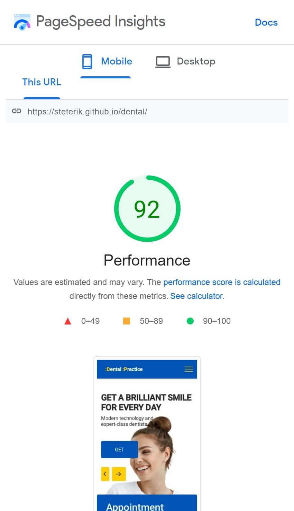

# This is the main page of the dentist's website
[Link to page⬅️][link]
## I used here:
* HTML (BEM, PUG)
* CSS (SASS)
* JavaScript:
	* Swiper-slider
	* Animations
	* Spoilers
	* Menu-burger
* GULP
* NPM
* GIT

[Link to page⬅️][link]

### Mobile Optimization

[link]: https://steterik.github.io/dental/